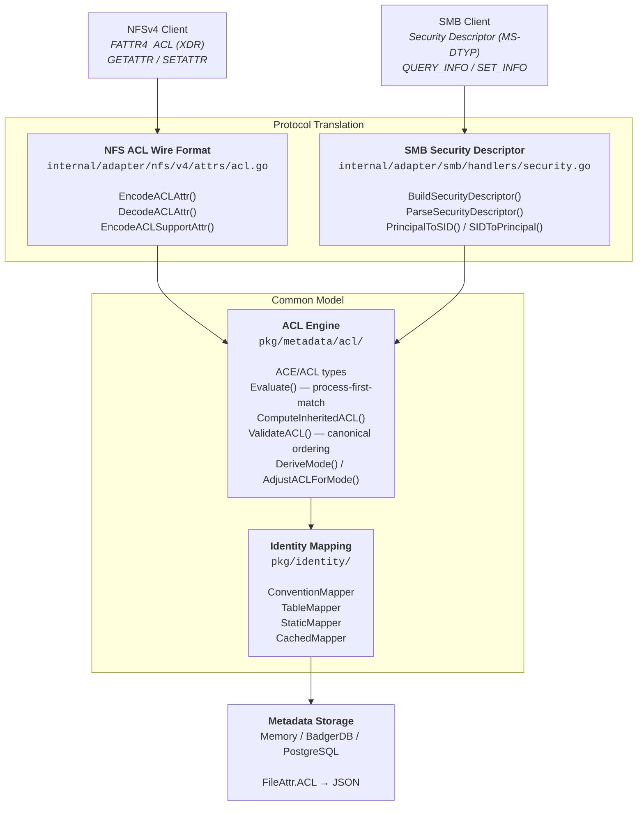

> For the internal ACL evaluation algorithm, canonical ordering, inheritance rules, mode synchronization, and design tradeoff analysis, see [../internals/acl-design.md](/docs/contributing/acl-design).

DittoFS implements a unified ACL model that works across both NFSv4 and SMB protocols. A single ACL set on a file via one protocol is immediately visible and enforceable from the other.

For a full glossary of terms (ACL, ACE, DACL, SID, security descriptor, etc.) see [./glossary.md](/docs/operations/glossary).

## Two permission layers

Access to a file is decided by **two independent layers**, both of which must allow the operation. This mirrors how enterprise NAS appliances (Windows Server, TrueNAS, Synology) separate *share permissions* from *filesystem permissions*.

1. **Share permissions (the export gate).** A coarse, per-share grant that decides *whether a principal may touch the export at all*, and at what ceiling (`none` / `read` / `read-write` / `admin`). This is the `--default-permission` on the share plus per-user/group grants:

   ```bash
   # Default for principals with no explicit grant (secure default: none)
   dfsctl share create --name /data --metadata default --local default --default-permission none

   # Grant alice read-write access to the export
   dfsctl share permission grant /data --user alice --level read-write
   ```

   A grant **only opens the gate**. It does not modify any file's owner, mode, or ACL.

2. **Filesystem permissions (POSIX mode + ACL).** Once past the gate, the file's own POSIX mode bits and ACL decide the actual operation — exactly as described in the rest of this page. A share-level grant never overrides these; a user granted `read-write` on the export still cannot write a file whose mode/ACL denies them.

**Effective access = share gate AND filesystem permission.** Both must allow.

### Share owner

A new share's **root directory** is created with a secure mode (`0755`) owned by `root`. Because the two layers are independent, granting a user `read-write` does **not**, by itself, let them create files *at the share root* — POSIX still applies, and only the owner (or root) can write a `0755` directory.

To make a share writable by a specific principal, set the **share owner** at creation:

```bash
# alice owns /home-alice: she can create files at its root.
# (Grant her export access too — the two layers are separate.)
dfsctl user create --username alice --uid 1000 --gid 1000 --password ...
dfsctl share create --name /home-alice --metadata default --local default --owner alice
dfsctl share permission grant /home-alice --user alice --level read-write
```

- `--owner` sets the UID/GID that owns the share's **root directory**. It defaults to `root` (UID/GID 0) when omitted.
- The owner can write at the root via normal POSIX rules. Other principals are governed by the root's mode/ACL plus their share grant.

> **Heads-up — this surprises people.** `share permission grant alice read-write` lets alice *into* the share but does **not** let her create files at the root unless she owns it (or it is group-/world-writable, or an ACL grants her). This is deliberate POSIX layering, not a bug. Common patterns:
> - make alice the **owner** (`--owner alice`) for a single-owner share;
> - have the owner/admin create **subdirectories** with appropriate modes for other users to work in;
> - set an explicit **ACL** on the root (see below) granting the desired principals.

## How it works

DittoFS stores one canonical ACL per file, derived from the NFSv4 ACL model (RFC 7530 §6), and translates on the wire for each protocol:

- **NFS** clients read and write ACLs via `GETATTR`/`SETATTR` with `FATTR4_ACL`. No translation is needed — the internal model is the wire format.
- **SMB** clients read and write ACLs via `QUERY_INFO`/`SET_INFO` as Windows Security Descriptors. DittoFS translates principals (NFS `user@domain` ↔ Windows SIDs) and encodes/decodes the binary Security Descriptor format.

The permission mask bits (READ_DATA, WRITE_DATA, EXECUTE, DELETE, …) are identical across both protocols by RFC design — no translation is needed for the actual permissions, only for the identity and wire encoding.



## Setting and reading ACLs

### Via NFS (nfs4_setfacl / nfs4_getfacl)

```bash
# Grant user alice full control
nfs4_setfacl -a 'A::alice@EXAMPLE.COM:rwaDxtTNcCy' /mnt/share/file.txt

# Grant the owning group read access
nfs4_setfacl -a 'A::GROUP@:r' /mnt/share/file.txt

# Deny everyone write access
nfs4_setfacl -a 'D::EVERYONE@:w' /mnt/share/file.txt

# Read the current ACL
nfs4_getfacl /mnt/share/file.txt
```

### Via SMB (Windows / icacls)

```cmd
:: Grant alice full control
icacls \\server\share\file.txt /grant alice:(F)

:: Grant the Administrators group read
icacls \\server\share\file.txt /grant Administrators:(R)

:: Deny Everyone write
icacls \\server\share\file.txt /deny Everyone:(W)

:: View current ACL
icacls \\server\share\file.txt
```

### chmod and mode bits

`chmod` works as expected. DittoFS syncs mode bits to and from the ACL automatically:

- When you `chmod`, the OWNER@/GROUP@/EVERYONE@ ACEs in the ACL are updated to match. All explicit named-user/group ACEs are left unchanged.
- When an ACL is set, `ls -l` mode bits are derived from the OWNER@/GROUP@/EVERYONE@ ALLOW entries.

A `nil` ACL (no ACL set) falls back to classic Unix permission checking (mode bits only). An explicit empty ACL denies all access.

## Identity mapping

NFS uses `user@domain` string principals; SMB uses Windows Security Identifiers (SIDs). DittoFS maps between them:

| NFS Principal | Windows SID | Notes |
|---------------|-------------|-------|
| `OWNER@` | `S-1-3-0` (CREATOR OWNER) | File owner, resolved dynamically |
| `GROUP@` | `S-1-3-1` (CREATOR GROUP) | Owning group, resolved dynamically |
| `EVERYONE@` | `S-1-1-0` (Everyone) | All principals |
| `{uid}@localdomain` | `S-1-5-21-0-0-0-{uid}` | Local numeric UID |
| `alice@EXAMPLE.COM` | `S-1-5-21-0-0-0-{hash}` | Hash-based; AD SIDs are lossy (see limitations) |

The identity mapping package (`pkg/identity/`) resolves NFS principals to Unix credentials (UID/GID) at evaluation time:

| Mapper | Strategy | Use case |
|--------|----------|----------|
| `ConventionMapper` | If domain matches configured realm, resolve username | Default for Kerberos environments |
| `TableMapper` | Explicit mapping table (principal → username) | AD environments with custom mappings |
| `StaticMapper` | Static configuration map | Small deployments with known users |
| `CachedMapper` | TTL-based cache wrapping any mapper | Performance (default 5-minute TTL) |

## Cross-protocol scenarios

### Scenario 1: NFS sets ACL, SMB reads it

```
1. NFS client: SETATTR with FATTR4_ACL
   ACEs: [ALLOW OWNER@ 0x1F01FF, DENY EVERYONE@ 0x02]

2. Stored internally as:
   ACL.ACEs = [{Type:ALLOW, Who:"OWNER@", Mask:0x1F01FF},
               {Type:DENY, Who:"EVERYONE@", Mask:0x02}]

3. SMB client: QUERY_INFO (Security)
   → BuildSecurityDescriptor()
   → ACE 1: ALLOW, SID=S-1-5-21-0-0-0-{ownerUID}, Mask=0x1F01FF
   → ACE 2: DENY,  SID=S-1-1-0 (Everyone), Mask=0x02
   → Windows Explorer shows correct permissions
```

### Scenario 2: SMB sets ACL, NFS reads it

```
1. SMB client: SET_INFO (Security Descriptor)
   DACL: [ALLOW S-1-1-0 0x1F01FF]  (Everyone, Full Control)

2. ParseSecurityDescriptor()
   → SIDToPrincipal(S-1-1-0) → "EVERYONE@"
   → Stored as: ACL.ACEs = [{Type:ALLOW, Who:"EVERYONE@", Mask:0x1F01FF}]

3. NFS client: GETATTR with FATTR4_ACL
   → EncodeACLAttr()
   → ACE: ALLOW "EVERYONE@" 0x1F01FF
   → nfs4_getfacl shows correct ACL
```

### Scenario 3: Mixed protocol access control

```
1. SMB client creates file with ACL:
   [ALLOW S-1-5-21-0-0-0-1000 READ_DATA, DENY S-1-1-0 WRITE_DATA]

2. NFS client (UID 1000) tries to read → evaluateACLPermissions()
   → ACE 1: "1000@localdomain" matches UID 1000 → READ allowed
   → Access granted

3. NFS client (UID 1000) tries to write → evaluateACLPermissions()
   → ACE 1: matches but no WRITE bit → undecided
   → ACE 2: "EVERYONE@" matches → WRITE denied
   → Access denied
```

## Known limitations

1. **Non-DittoFS SIDs are lossy**: Real Active Directory SIDs (e.g., `S-1-5-32-544` for Administrators) are stored as string representations but mapped to UID 65534 (nobody) when parsed back. Round-trip fidelity is lost for AD domain SIDs.

2. **Hash-based SID generation**: Named principals without numeric UIDs (e.g., `alice@EXAMPLE.COM`) produce a hash-based RID when converted to SID. This is deterministic but could theoretically collide.

3. **SACL round-trips but audit events are not generated**: System ACLs (audit/alarm ACEs) are parsed, stored, and surfaced to SMB clients in the Security Descriptor's SACL section — Windows Explorer's "Auditing" tab reads back what was set, and the `ACCESS_SYSTEM_SECURITY` gate is enforced. What is not implemented is *acting* on them: the server emits no audit log when an operation matches a SUCCESSFUL/FAILED audit ACE, and ALARM ACEs raise no alarm. See [SMB ACL fidelity § SACL](/docs/connect/smb-acl-fidelity#sacl-audit).

4. **Owner/Group not in ACL**: Windows Security Descriptors bundle owner, group, and DACL together. DittoFS stores owner (UID) and group (GID) separately in file attributes. This is transparent to clients but means owner/group changes don't trigger ACL-related events.

## References

- [RFC 7530 Section 6](https://tools.ietf.org/html/rfc7530#section-6) — NFSv4 ACL specification
- [MS-DTYP Section 2.4](https://docs.microsoft.com/en-us/openspecs/windows_protocols/ms-dtyp/) — Windows Security Descriptor format
- [RFC 7530 Section 6.4.1](https://tools.ietf.org/html/rfc7530#section-6.4.1) — Mode/ACL synchronization
